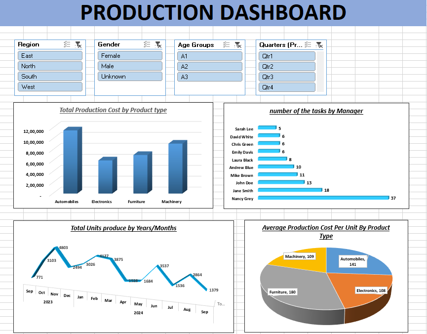

# 📊 Production Dashboard

## Overview

This Excel-based **Production Dashboard** offers a detailed overview of key production metrics such as production costs, units produced, and task distribution by manager. It is designed to assist in decision-making by providing interactive filtering and visual insights.

---

## 📁 Contents

The dashboard includes the following key components:

### 🎚️ Filters
- **Region**: East, North, South, West  
- **Gender**: Female, Male, Unknown  
- **Age Groups**: A1, A2, A3  
- **Quarters**: Qtr1, Qtr2, Qtr3, Qtr4  

These filters (slicers) allow users to interactively slice the data for specific demographic or time-based views.

---

### 📊 Visualizations

#### 1. Total Production Cost by Product Type
- Bar chart comparing total production costs across:
  - Automobiles
  - Electronics
  - Furniture
  - Machinery

#### 2. Number of Tasks by Manager
- Horizontal bar chart showing task distribution among managers.
- Top managers by task count:
  - Nancy Grey: 37 tasks
  - Jane Smith: 18 tasks
  - John Doe: 13 tasks

#### 3. Total Units Produced by Year/Month
- Line chart showing monthly production units from Sep 2023 to Sep 2024.
- Useful for identifying production trends over time.

#### 4. Average Production Cost Per Unit by Product Type
- Pie chart representing average cost per unit:
  - Automobiles: 141
  - Electronics: 108
  - Furniture: 180
  - Machinery: 109

---

## 🔧 How to Use

1. Open the Excel file containing the dashboard.
2. Use the slicers to filter data by Region, Gender, Age Group, and Quarter.
3. Analyze the charts to understand performance, cost efficiency, and production trends.
4. Use insights for reporting, planning, and process improvements.

---

## 🛠 Requirements

- **Software**: Microsoft Excel 2016 or later
- **Features Used**: PivotTables, Charts, Slicers

